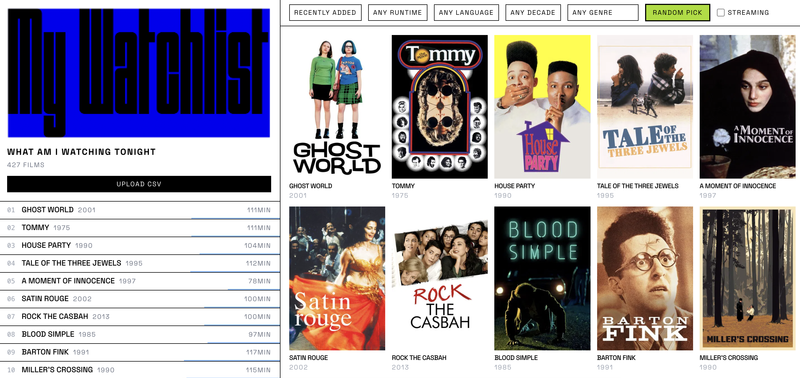
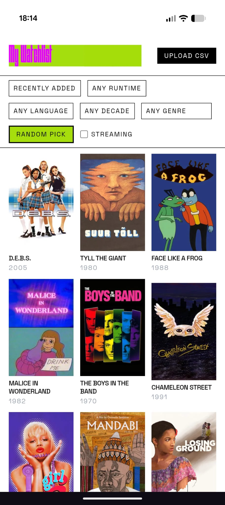

# My Watchlist

Personal web app to browse and filter my Letterboxd watchlist. Upload a CSV export from Letterboxd, filter by runtime, genre, decade, language, and streaming availability, and pick a random film to watch.

Installed as a PWA on Android.

## Desktop view


## Mobile view


## Local development

1. Clone the repo
2. Create a `.env.local` file:

```
TMDB_API_KEY=your_key_here
```

Get a TMDB API key at [themoviedb.org/settings/api](https://www.themoviedb.org/settings/api).

3. Install dependencies and run:

```bash
npm install
npm run dev
```

App runs at [http://localhost:3000](http://localhost:3000). Basic auth is skipped locally if `BASIC_AUTH_USER` and `BASIC_AUTH_PASSWORD` are not set in `.env.local`.

## Deployment

Hosted on Vercel. Pushes to `main` should auto-deploy; if not, trigger a manual redeploy from the Vercel dashboard.

### Required environment variables in Vercel

| Variable | Description |
|---|---|
| `TMDB_API_KEY` | TMDB API key |
| `BASIC_AUTH_USER` | Username for basic auth |
| `BASIC_AUTH_PASSWORD` | Password for basic auth |

## Stack

- Next.js 16, React 19, TypeScript, Tailwind CSS v4
- TMDB API for film metadata and streaming availability
